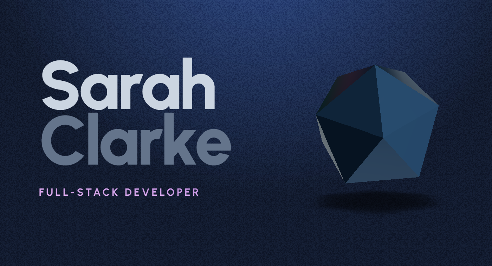

## Portfolio

This portfolio showcases my journey as a software developer, including projects, skills, and experiences. Built with Next.js, Prismic CMS, and GSAP for animations, it highlights my ability to combine clean design with dynamic interactions.

## Getting Started

These instructions will help you set up the project locally and understand how it works.

### Prerequisites

- **Node.js** - Download and install from [Node.js](https://nodejs.org/).
- **Prismic CMS Account** - Create an account at [Prismic](https://prismic.io/) and create a new repository.

### Installation

1. **Clone the Repository:**
2. **Install Depenencies**
3. **Setup Prismic**
4. **Start the project (npm run dev)**

## Features
- **Custom animations with GSAP & Three.js: I used GSAP for animations, adding interactive transitions and hover effects.**
- **Prismic CMS Integration: Content is managed using Prismic - separated from the codebase.**
- **Responsive Design: The layout adjusts to variuos screen sizes, ensuring a smooth exerince on desktops, tablets, and mobile devices.**

## Resources

- [YouTube Tutorial - Create a Stunning Animated Portfolio Website with Next.js, Three.js, GSAP and Prismic](https://www.youtube.com/watch?v=rXDCAAkiC-s&list=PLUhSgROuR9jnxcmWYgT0TTTp34ARjrkfo&index=12): I followed this tutorial to set up the foundation of the project, and learned valuable techniques for building with Next.js, Three.js, GSAP and Prismic.

